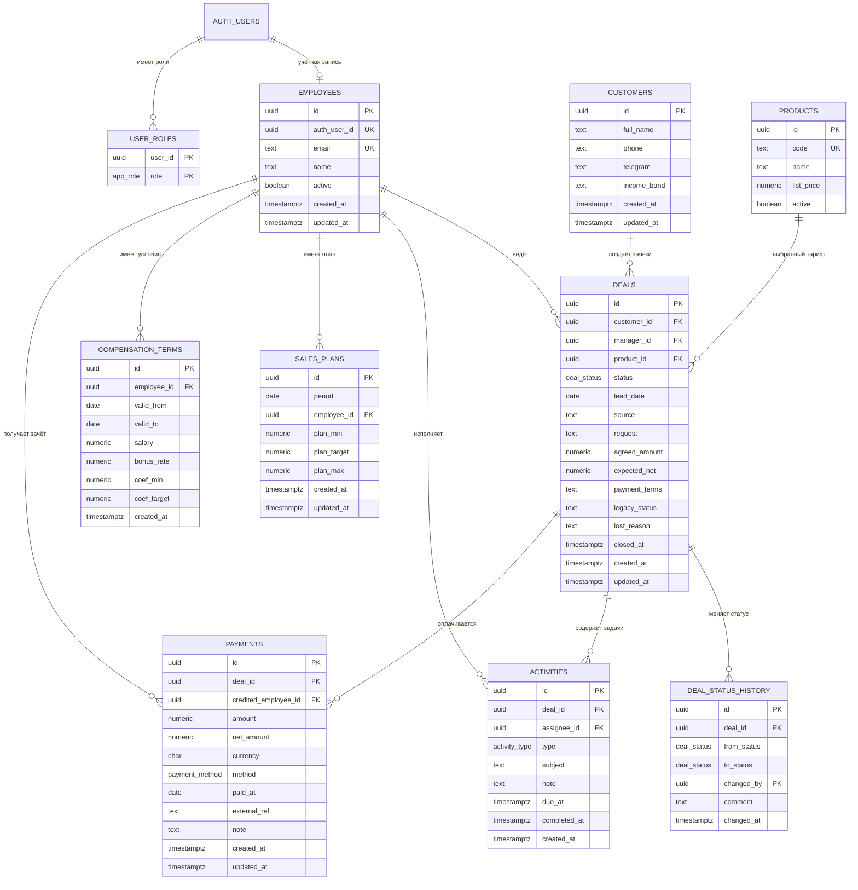

# Проект схемы базы данных CRM

> Статус: **согласовано для подготовки миграций**. Решения подтверждены владельцем проекта 2 октября 2026 года. Этот документ пока не меняет рабочую базу.

## 1. Что уже есть в проекте

Приложение уже ориентировано на Supabase/PostgreSQL и использует таблицы `employees`, `user_roles`, `leads`, `payments` и `plans`. Текущая схема подходит для прототипа, но у неё есть ограничения:

- данные клиента и конкретной продажи смешаны в `leads`;
- тариф хранится текстом и может называться по-разному;
- одна сделка фактически рассчитана на один автоматически созданный платёж;
- перенос сделки в статус `paid` может создать платёж с нулевой суммой;
- текущий оклад и проценты сотрудника используются для всех периодов, поэтому изменение условий способно исказить историю;
- нет истории смены статусов и нормальных задач/следующих действий;
- текстовое поле `schedule` остаётся неструктурированным условием оплаты и не позволяет строить полноценный график рассрочки. Полноценный график на первом этапе не требуется.

## 2. Предлагаемая база

Рекомендация: оставить **Supabase + PostgreSQL**. Это соответствует текущему коду, авторизации и Row Level Security, поэтому не потребуется вводить второй сервер или другую СУБД.

Базовые правила:

- первичные ключи — `uuid`;
- денежные значения — `numeric(14,2)`, валюта по умолчанию `RUB`;
- моменты времени — `timestamptz` в UTC, бизнес-даты — `date`;
- все изменяемые сущности имеют `created_at` и `updated_at`;
- персональные данные доступны только руководителю и назначенному менеджеру;
- финансовые итоги считаются только по реальным платежам;
- удаление важных бизнес-записей ограничивается, вместо него используется архивирование.

## 3. ER-схема



`AUTH_USERS` на диаграмме — системная таблица `auth.users`, которой управляет Supabase Auth. Мы не дублируем в публичной схеме пароли или секреты авторизации.

## 4. Таблицы и ответственность

### `employees` и `user_roles`

`employees` хранит профиль сотрудника и связывает его с `auth.users`. Роли остаются в отдельной таблице `user_roles`, чтобы RLS-политики не зависели от редактируемого профиля.

Роли первого этапа:

- `admin` — видит и управляет всей CRM;
- `manager` — видит свои сделки, клиентов, задачи, платежи и план.

Ограничения:

- `employees.auth_user_id` — уникальный nullable FK на `auth.users(id)`;
- `employees.email` хранится в нижнем регистре и уникален среди непустых значений;
- PK `user_roles` — `(user_id, role)`, отдельный искусственный `id` не нужен.

### `customers`

Хранит человека независимо от сделки. Один клиент сможет обратиться повторно или приобрести несколько продуктов без копирования контактов.

На первом этапе телефон и Telegram не следует делать строго уникальными: в импортированных данных они могут отсутствовать, быть записаны в разных форматах или использоваться несколькими членами семьи. Для поиска добавляются нормализованные служебные значения либо функциональные индексы.

### `products`

Справочник тарифов/продуктов. В сделке хранится ссылка на продукт и отдельно `agreed_amount`, потому что фактическая цена может отличаться от прайса.

### `deals`

Заменяет текущую бизнес-роль таблицы `leads`: это заявка и процесс продажи, а не карточка человека. Предлагаемые статусы первого этапа:

```text
new → in_work → offer_sent → awaiting_payment → paid
                    └────────────────────────→ lost
```

Статус `awaiting_payment` согласован и будет отдельной колонкой канбана. Частичная оплата не требует отдельного статуса: сумма поступлений видна по `payments`, а `paid` означает, что получена согласованная сумма.

### `deal_status_history`

Каждое изменение `deals.status` фиксируется триггером. Таблица нужна для аналитики конверсии, времени прохождения этапов и разбора действий сотрудников.

### `activities`

Заменяет одиночное текстовое поле `next_action`. Поддерживает несколько звонков, встреч, сообщений и задач, сроки и факт выполнения. Для карточки сделки ближайшая незавершённая активность является следующим действием.

### `payments`

`payments` хранит только фактически поступившие деньги. На одну сделку разрешено несколько платежей. Полноценный график рассрочки на первом этапе не создаётся; договорённости об оплате сохраняются в `deals.payment_terms` как текст.

Правила:

- платёж можно создать отдельным действием из карточки сделки или раздела оплат;
- перенос карточки в `paid` открывает ту же обязательную форму оплаты с суммой, датой и способом; после подтверждения платёж и смена статуса записываются атомарно в одной транзакции;
- если сделка уже полностью оплачена ранее, перенос в `paid` не создаёт повторный платёж и только подтверждает смену статуса;
- отмена формы возвращает карточку в исходную колонку и ничего не записывает;
- платёж всегда имеет положительную сумму;
- `credited_employee_id` фиксирует, кому засчитана продажа, даже если ответственный за сделку позже изменился;
- `external_ref` можно использовать для идентификатора банковской операции/чека и защиты от повторного импорта;
- сумма оплат по сделке не обязана совпадать с ценой до полного закрытия сделки;
- после достижения суммы `deals.agreed_amount` интерфейс предлагает перевести сделку в `paid`; автоматического скрытого изменения статуса не происходит.

### `sales_plans`

Хранит месячные планы сотрудника и общий план компании. `period` всегда равен первому дню месяца.

Ограничения:

- `plan_min >= 0`;
- `plan_min <= plan_target <= plan_max`;
- одна запись на `(period, employee_id)`;
- одна общая запись на период с `employee_id IS NULL`;
- удаление сотрудника не удаляет исторические планы.

### `compensation_terms`

Хранит историю оклада, процента и коэффициентов с периодом действия. Благодаря этому расчёт премии за февраль не изменится после обновления условий в марте.

Для одного сотрудника периоды действия не должны пересекаться. Это обеспечивается exclusion constraint по диапазону дат либо проверкой в транзакционной функции.

## 5. Индексы

Минимальный набор для текущих экранов:

```sql
CREATE INDEX deals_manager_status_idx
  ON deals (manager_id, status, lead_date DESC);

CREATE INDEX deals_customer_idx
  ON deals (customer_id, created_at DESC);

CREATE INDEX activities_assignee_due_open_idx
  ON activities (assignee_id, due_at)
  WHERE completed_at IS NULL;

CREATE INDEX payments_paid_at_idx
  ON payments (paid_at DESC);

CREATE INDEX payments_employee_paid_at_idx
  ON payments (credited_employee_id, paid_at DESC);

CREATE UNIQUE INDEX payments_external_ref_idx
  ON payments (external_ref)
  WHERE external_ref IS NOT NULL;

CREATE UNIQUE INDEX sales_plans_employee_period_idx
  ON sales_plans (employee_id, period)
  WHERE employee_id IS NOT NULL;

CREATE UNIQUE INDEX sales_plans_company_period_idx
  ON sales_plans (period)
  WHERE employee_id IS NULL;
```

После накопления данных для поиска клиентов стоит добавить `pg_trgm`-индексы по имени, телефону и Telegram.

## 6. RLS и безопасность

Все таблицы публичной схемы работают с включённым RLS.

| Данные                       | `admin`                               | `manager`                                                                               |
| ---------------------------- | ------------------------------------- | --------------------------------------------------------------------------------------- |
| Сотрудники и роли            | все; изменение только администратором | только собственный профиль и роли                                                       |
| Клиенты и сделки             | все                                   | только клиенты, у которых есть назначенная ему сделка, и собственные сделки             |
| Задачи                       | все                                   | назначенные ему и относящиеся к его сделкам                                             |
| Платежи                      | все операции                          | чтение, создание и изменение платежей по своим сделкам; удаление только администратором |
| Планы и условия оплаты труда | все операции                          | чтение только собственных                                                               |

Для политик используются `SECURITY DEFINER`-функции `has_role()` и `current_employee_id()` с фиксированным `search_path`. Все функции изменения финансов должны проверять роль внутри функции, а не только в интерфейсе.

## 7. Расчёты и представления

Расчётные показатели не дублируются в таблицах без необходимости. Для экранов приложения предлагаются представления или RPC-функции:

- `deal_payment_totals` — оплачено, остаток и признак полной оплаты по сделке;
- `employee_monthly_results` — выручка и чистая сумма сотрудника за месяц;
- `employee_bonus_preview(employee_id, period)` — план, действующие условия, коэффициент, премия и итог к выплате;
- `pipeline_summary` — количество и сумма сделок по статусам.

Расчёт премии выполняется на сервере по `payments.credited_employee_id` и условиям, действовавшим в выбранном месяце. Клиентский расчёт может остаться для мгновенного предпросмотра, но не должен быть единственным источником итоговой суммы.

## 8. Перенос текущих данных

Предлагаемый безопасный порядок после согласования:

1. Создать новые справочники и таблицы без удаления старых.
2. Перенести уникальных клиентов из `leads` в `customers`, сохранив исходные значения.
3. Перенести каждую строку `leads` в `deals` и сохранить соответствие старого и нового `id`.
4. Создать продукты из уникальных непустых значений `leads.tariff`.
5. Перенести существующие `payments`, связать их со сделками и зафиксировать получателя зачёта.
6. Преобразовать `next_action` в открытые `activities`, а `schedule` перенести в `deals.payment_terms` без попытки построить график рассрочки.
7. Создать начальные `compensation_terms` из текущих полей сотрудников.
8. Переключить код приложения на новые таблицы и проверить суммы по каждому месяцу.
9. Оставить старые таблицы только для чтения на контрольный период; удалить их отдельной миграцией после сверки.

Источником миграции являются данные, уже находящиеся в Supabase. Локальный Excel-файл не используется для первичной загрузки и может служить только для дополнительной ручной сверки.

Миграция должна быть идемпотентной: повторный запуск не создаёт дубликаты. До переноса выполняется резервная копия Supabase и сверяются количество сделок, платежей и месячные суммы.

## 9. Согласованные решения

1. Человек (`customers`) и каждая продажа (`deals`) хранятся отдельно.
2. Платёж создаётся двумя способами: отдельным действием и через перенос карточки в `paid` с обязательным подтверждением данных оплаты.
3. В воронку добавляется статус `awaiting_payment` («Ожидает оплаты»).
4. Полноценный график рассрочки не создаётся; условия оплаты хранятся текстом в сделке, а фактические поступления — отдельными строками `payments`.
5. Менеджер может создавать и редактировать платежи по своим сделкам. Удалять платежи может только администратор.
6. История окладов, процентов и коэффициентов хранится в `compensation_terms`.
7. Первичным источником переноса являются данные, уже находящиеся в Supabase; локальный Excel повторно не импортируется.

На основании этих решений схема готова к преобразованию в последовательность обратимых SQL-миграций и обновлению типов Supabase без потери текущих данных.
